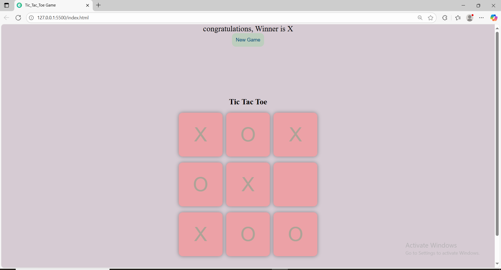

# 🎮 Tic Tac Toe Game

A simple and fun **Tic Tac Toe** game built using **HTML**, **CSS**, and **JavaScript**, where you can play against the computer.

## 📌 Features
- Play against a computer opponent.
- Interactive and responsive UI.
- Simple, clean, and minimal design.
- No installation required — just open the HTML file.

## 🚀 How to Run
1. Download or clone this repository:  
   git clone https://github.com/your-username/tic-tac-toe.git
2. Open the project folder.
3. Double-click on `index.html` or open it in your browser.
4. Start playing!

## 📂 Project Structure
index.html   → Main game file  
style.css    → Game styling  
script.js    → Game logic  

## 🛠️ Technologies Used
- HTML5
- CSS3
- JavaScript (Vanilla)

## 📷 Screenshot

## 📜 License
This project is open-source and available under the MIT License.

---
💡 Have fun playing and improving the game!
